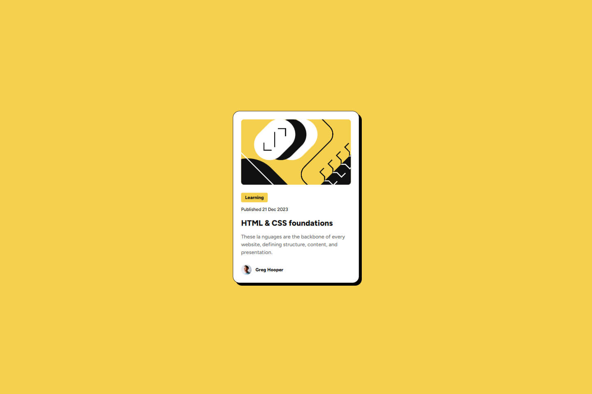

# Frontend Mentor - Blog preview card solution

Это моё решение задачи [Blog preview card challenge на Frontend Mentor](https://www.frontendmentor.io/challenges/blog-preview-card-ckPaj01IcS). Проект помогает отработать навыки семантической вёрстки, точного позиционирования элементов и оформления интерактивных состояний.

## 📸 Скриншот

## 🔗 Ссылки

- Репозиторий: [GitHub Repository](https://github.com/Rud1K3nt37/fem-blog-preview-card.git)  
- Демо-версия: [Live Website](https://rud1k3nt37.github.io/fem-blog-preview-card/)

## ⚙️ Мой процесс

### Использовано:

- Семантическая HTML5-разметка
- CSS custom properties (переменные)
- Flexbox
- Mobile-first подход
- Псевдоклассы `:hover`, `:focus`
- Пиксель-перфект по макету

### Что я изучил:

- Тонкая работа с отступами, шрифтами и расстояниями
- Структурирование карточки с правильной семантикой (теги `time`, `article`, `h1`)
- Применение `transition` для плавных анимаций
- Улучшенное понимание кастомных свойств и повторного использования стилей

### Что буду развивать дальше:

- Продолжу практиковаться в написании доступной и гибкой разметки
- Буду изучать более сложные паттерны компонентов
- Хочу начать собирать библиотеку переиспользуемых блоков и элементов

## 🙋‍♂️ Автор

- Frontend Mentor – [@Rud1K3nt37](https://www.frontendmentor.io/profile/Rud1K3nt37)
- GitHub – [@Rud1K3nt37](https://github.com/Rud1K3nt37)

## 🙌 Благодарности

Спасибо платформе Frontend Mentor за качественные макеты и задания. Это мой второй проект, и я чувствую прогресс уже сейчас.
